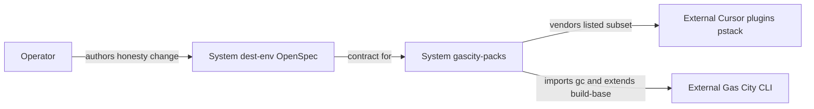
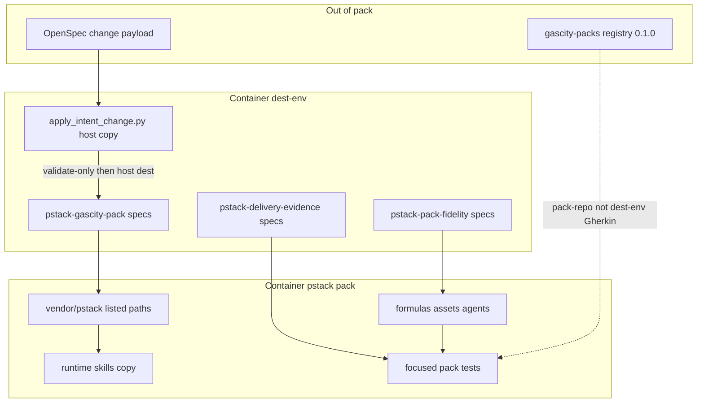
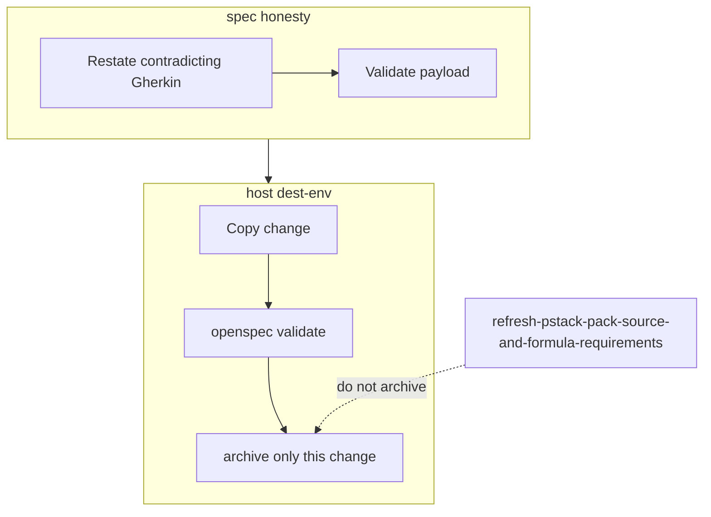

## Context

The PStack pack is a schema-2 Gas City methodology layer. Durable specs live in
dest-env. The pack vendors official Cursor pstack from `cursor/plugins` path
`pstack` at `6fecddba65801f9b9c08b8b328d998ee5b09d290` and byte-copies `skills/`
into the runtime tree. Gas City mapping lives in pack-owned formulas, assets,
and agents. Refresh work already landed in the pack and was mostly copied into
live specs by hand without `openspec archive`.

gascity-packs already catalogs pstack `0.1.0` and includes the pack in
installer lint, CI, supported-pack nightly, and inference. Dest-env OpenSpec
has no pack-catalog requirement, so this change does not add one. Dest-env
`pstack-delivery-evidence` still lists "Adding PStack to `registry.toml`" as a
historical Non-Goal. That sentence is pack-repo stale. It is not a dest-env
catalog contract.

Assumptions for diagrams. Purpose is existing pack versus dest-env specs.
Format is plain Mermaid. Rigor is lightweight C4-inspired container view.

## Goals / Non-Goals

**Goals:**

- Make live dest-env Gherkin describe the pack that exists today.
- Keep the Cursor vendor pin explicit and later source drift reviewable.
- Encode the compiler-requirement check the pack suite already runs.
- Name the five packs already in dest-env's derived-pack compatibility suite.

**Non-Goals:**

- No Gas City interpreter for `gc.graph_operator` / `pstack.graph_operator`.
- No vendor pin advance to Cursor `main`.
- No pin of `tommy-ca/pstack`.
- No archive of `refresh-pstack-pack-source-and-formula-requirements`.
- No dest-env pack-catalog requirement for registry `0.1.0`.
- No dest-env requirement titled `GC-METH-012`. Dest-env already has derived-pack
  compatibility Gherkin. The pack-repo ledger name stays in gascity-packs.
- No babysit/orchestrate redesign off `pstack-build`.
- No metadata-cook script.
- No vendoring of Cursor `docs/guide` or Benny automations.

## Decisions

1. **Restate only dest-env requirements that contradict the pack.** Full
   MODIFIED blocks. Matching requirements such as schema producer context and
   validator portability stay live.

2. **Vendor is the Cursor listed subset.** Pin
   `https://github.com/cursor/plugins` path `pstack` commit
   `6fecddba65801f9b9c08b8b328d998ee5b09d290`. Listed paths are skills, agents,
   README, and LICENSE. Runtime skills match vendored skills. Tests do not
   `git archive` Cursor `main`. Rejected. Complete documentation/automation
   corpus. That is not what the pack ships.

3. **Host-boundary is pack-owned.** Grep formulas, assets, and agents. Vendored
   Cursor playbooks may name `watch-pr` and `orch.ts`. Rejected. Requiring
   vendored babysit to drop those paths. That would rewrite Cursor upstream.

4. **OpenSpec payloads stay outside the pack.** `pstack/intent/` must not exist.
   `apply_intent_change.py` refuses `--source` under `pstack/`. Dest-env owns
   durable Gherkin. Rejected. Shipping the change under the pack.

5. **Method formulas stay sequential annotations.** `graph_operator` remains
   metadata. TRACEABILITY keeps the known gap. Operator README documents a
   local clone. Method stems stay off `playbooks.toml`. Rejected. Inventing a
   consumer.

6. **Five-pack derived-pack suite is dest-env's existing compatibility
   requirement.** Name `compound-engineering`, `superpowers`, `bmad`,
   `gstack`, and `pstack` in that Gherkin. Do not invent a dest-env
   `GC-METH-012` heading. That ID lives in pack-repo ledgers.

7. **Registry `0.1.0` is pack-repo catalog, not dest-env Gherkin.** Dest-env
   has no pack-catalog requirement. This change does not add one. Rejected.
   Promoting installer/nightly into dest-env MUST language.

8. **No new durable ADR.** ADR-0029 already covers pin, validator portability,
   compiler requirements, and the graph-operator non-interpreter. This change
   corrects spec language. It does not supersede ADR-0027's methodology-pack
   decision. It does correct ADR-0027's "complete corpus" wording at Gherkin
   layer only.

## Risks / Trade-offs

- Honest Gherkin shrinks live MUST language from executed fanout and complete
  corpus to sequential formulas and a listed subset. Callers who read dest-env
  as a full Cursor mirror will see the contract shrink. That is the point.
- Leaving the refresh change unarchived keeps two overlapping active folders
  until a later archive grant. Safer than colliding ADDED requirements.
- Dest-env delivery Non-Goal about `registry.toml` remains in the live spec
  file until a later dest-env edit. OpenSpec archive merges requirements, not
  Non-Goals. This change does not invent a catalog requirement to paper over
  that leftover sentence.

## Migration Plan

1. Land this change's proposal, specs, design, and ADR review as a dest-env
   payload outside `pstack/`.
2. Validate with
   `python pstack/scripts/apply_intent_change.py --source <DIR> --validate-only`.
3. From a host shell, copy with `--dest /home/tommyk/projects/dev-env`.
4. Archive only this change after an explicit grant. Do not archive
   `refresh-pstack-pack-source-and-formula-requirements`.

## Open Questions

- When to rewrite and archive `refresh-pstack-pack-source-and-formula-requirements`.
- When Gas City publishes a graph-operator interpreter, a later change must
  restore executed-fanout Gherkin rather than keep this annotation contract.
- Whether dest-env should later drop the historical `registry.toml` Non-Goal
  without adding a pack-catalog requirement.
