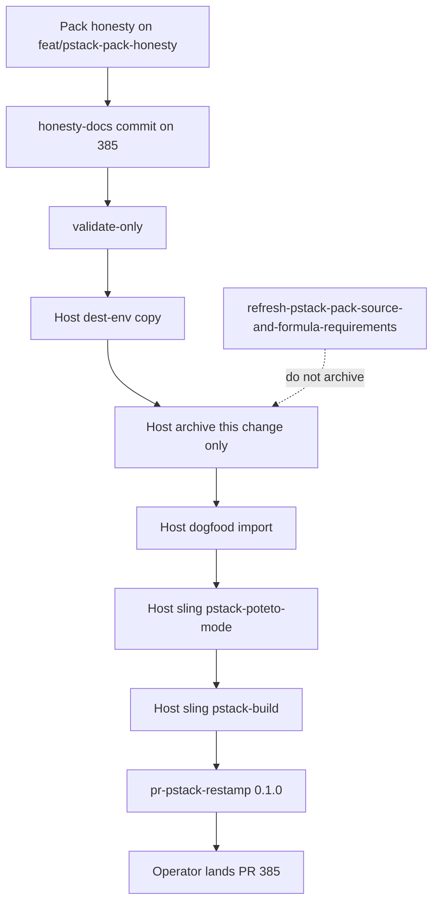

# Task graph

Recursive production path. Pack honesty and the classify router sit on PR 385.
Catalog honesty-docs is a commit on that branch. Host dest-env and host sling
gate the restamp. The operator lands PR 385 after restamp.

## 0. Pack honesty already on the branch

- [x] 0.1 Cursor vendor pin `6fecddba`, listed paths, no tommy-ca.
- [x] 0.2 No `pstack/intent/`.
- [x] 0.3 `pstack-poteto-mode` classify-only.
- [x] 0.4 Schema inventory script reuses Gas City `validate_schema_definition`.
- [x] 0.5 Formula catalog strings for swarm, arena, interrogate, and hillclimb do not claim expanded fanout.

## 0b. Catalog honesty-docs on 385

Needs 0. Same branch. Not a second GitHub PR.

- [x] 0b.1 `pstack/README.md` leads with a local clone import.
- [x] 0b.2 TRACEABILITY forbids restamp without a host sling.
- [x] 0b.3 Root README pstack row says not a slung production import.
- [x] 0b.4 `gascity/REQUIREMENTS.md` header lists pstack.
- [x] 0b.5 Pack tests lock those strings and exclude method stems from `playbooks.toml`.
- [ ] 0b.6 Commit those files on `feat/pstack-pack-honesty` before the restamp SHA.

## 1. OpenSpec payload and validate-only

Needs 0b Gherkin. Payload lives under `.work/openspec-changes/`.

- [x] 1.0 `apply_intent_change.py --source` is required and refuses pack-local paths.
- [x] 1.1 Delivery-evidence Gherkin names README catalog honesty and playbook-map stems.
- [x] 1.2 `python pstack/scripts/apply_intent_change.py --source /home/tommyk/projects/gascity-packs/.work/openspec-changes/audit-pstack-gascity-pack-contracts --validate-only` prints valid.

## 2. Host dest-env

Needs 1. Dest-env write is host-only. This pack does not keep a dest-env checkout.

- [ ] 2.1 From a host shell, run `python pstack/scripts/apply_intent_change.py --source /home/tommyk/projects/gascity-packs/.work/openspec-changes/audit-pstack-gascity-pack-contracts --dest /home/tommyk/projects/dev-env`.
- [ ] 2.2 Run `openspec validate audit-pstack-gascity-pack-contracts --type change --strict` in dest-env.
- [ ] 2.3 Archive only this change. Do not archive `refresh-pstack-pack-source-and-formula-requirements`.
- [ ] 2.4 Prove live swarm THEN is sequential `frame`, `fanout`, and `fanin`.

## 3. Host dogfood city

Needs 0b. May run beside 2.

- [ ] 3.1 `gc init` a disposable city. Import `gascity/roles` and `../gascity-packs/pstack`. Run `gc import install`.
- [ ] 3.2 Sling `pstack-poteto-mode` with `subject_path` and `artifact_path`. Keep the `pstack.route.v1` artifact.
- [ ] 3.3 Sling the routed `formula` or sling `pstack-build`. Keep the receipt.
- [ ] 3.4 Do not treat gastownhall `main` `gc import add` as the first city.

## 4. Restamp and land

Needs 2 and 3.

- [ ] 4.1 `pr-pstack-restamp` updates `registry.toml` `0.1.0` commit and hash to the SHA that contains the receipts and honesty-docs.
- [ ] 4.2 `python3 validate_registry.py` prints ok.
- [ ] 4.3 Operator lands https://github.com/gastownhall/gascity-packs/pull/385
