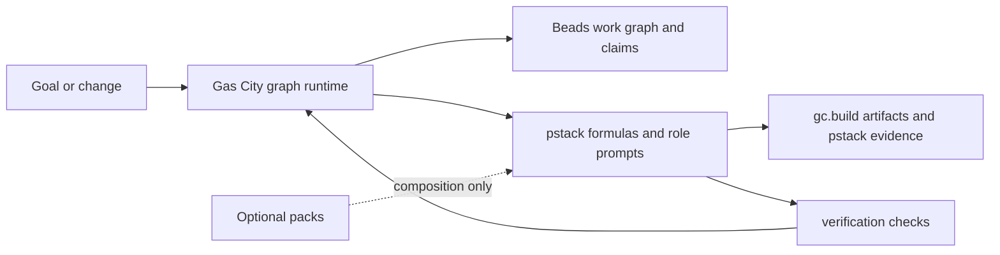
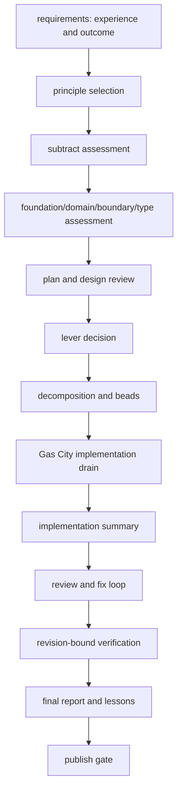

# PStack Gas City Pack Design

## Boundary

Gas City owns graph execution, durable state, claims, drains, continuation, retries, and workspaces. PStack owns method selection, principle enforcement, evidence schemas, and providerless prompts. Optional packs compose formulas; they never become required runtime dependencies.

## Build flow

`pstack-build` is a derived `build-base` formula. Its extra gates attach to base anchors; they do not fork or replace the lifecycle. Separate and same-session drains use the base contracts and selector variables.

## Data schemas

### Shared lifecycle artifacts

Use the imported schemas without wrappers:

- `gc.build.requirements.v1`: goal, scope, acceptance, constraints, user experience.
- `gc.build.plan.v1`: ordered implementation steps, dependencies, verification predicates.
- `gc.build.decomposition.v1`: beads, ownership, boundaries, dependencies, completion predicates.
- `gc.build.implementation-summary.v1`: changed files, claims, checks, evidence.
- `gc.build.review.v1`: findings, severity, disposition, verification status.
- `gc.build.final-report.v1`: outcome, evidence, remaining risk, publication state.

### PStack-specific schemas

PStack adds only method evidence not represented by `gc.build.*`:

| Schema | Required data |
|---|---|
| `pstack.source-binding.v1` | id, source path/section/commit, target formula/node, realization type, status, rationale |
| `pstack.principle-application.v1` | principle, trigger, decision, enforcement, evidence |
| `pstack.foundation.v1` | domain, boundaries, invariants, ownership, rejected assumptions |
| `pstack.lever-decision.v1` | repeated cost, lever, pilot, fanout threshold, decision |
| `pstack.reproduction.v1` | symptom, input, environment, expected/actual, repeatability |
| `pstack.root-cause.v1` | causal chain, evidence, rejected hypotheses, fix boundary |
| `pstack.verification.v1` | subject kind/id, revision, checks, evidence references, verdict |
| `pstack.arena-candidate.v1` | candidate, shape, assumptions, evidence, tradeoffs |
| `pstack.arena-synthesis.v1` | candidates, cross-judge, synthesis, decision, dissent |
| `pstack.swarm-result.v1` | child work, claims, findings, aggregation, unresolved items |
| `pstack.decision.v1` | problem, options, chosen path, subtraction, rationale |
| `pstack.frontier.v1` | active frontier, dependencies, owner, predicate, escalation |
| `pstack.standing-orders.v1` | order, trigger, scope, expiry, evidence target |
| `pstack.program-status.v1` | goal, phase, predicate, blockers, restart token, evidence |

Every PStack artifact carries stable work/claim references and evidence status. Every PStack schema declares the shared coverage-status vocabulary and `producer.attempt` so the shared validator can validate nonempty trace coverage. Static or metadata evidence is never labeled runtime evidence.

## Formula graph

- `pstack-how`, `pstack-why`, and `pstack-investigation`: read-mostly sequence → evidence artifact.
- `pstack-swarm`: sequential frame, fanout, and fanin steps writing `pstack.swarm-result.v1`. `gc.graph_operator` is annotation until Gas City interprets it.
- `pstack-arena`: sequential trigger, candidates, judge, and verify steps. Candidates write one `pstack.arena-candidate.v1` path. `gc.graph_operator` is annotation until Gas City interprets it.
- `pstack-interrogate`: sequential select, review, and judgment steps. Review lanes are not expanded as separate graph children in this checkout.
- `pstack-autonomous-run`: goal → predicate → baseline → bounded loop → evidence → predicate check.
- `pstack-orchestrate`: extends `pstack-build`. Standing-order and frontier steps run after the inherited implementation drain. It does not schedule outside Gas City.

Build variants compose these formulas:

- feature: `pstack-build` plus experience, subtraction, and verification gates;
- bug-fix: reproduction and root-cause before the build plan, then same-surface verification;
- refactor/migration: subtraction, foundation, callers, lever/pilot, migration waves, legacy absence;
- perf: baseline, bounded experiment, and revision-bound verification;
- prototype: experience target, smallest verifiable slice, explicit expiry;
- shipping: catalog alias of `pstack-build`;
- babysit/autopilot: extend `pstack-build`, so they inherit implement and publish until a later formula-design change detaches them.

## Role and code flow

1. A Gas City formula creates graph nodes with abstract `gc.run_target` values.
2. Gas City dispatches a role with a scoped prompt and claim token.
3. The role reads only the selected principle skills and required artifacts.
4. The role writes a result artifact and claims evidence against the node.
5. Gas City updates Beads state and unlocks dependent nodes.
6. Checks validate schema, revision, ordering, and absence predicates.

The pack has no provider-specific API calls. Runtime assets can select interaction and review modes, but the runtime remains Gas City-owned.
