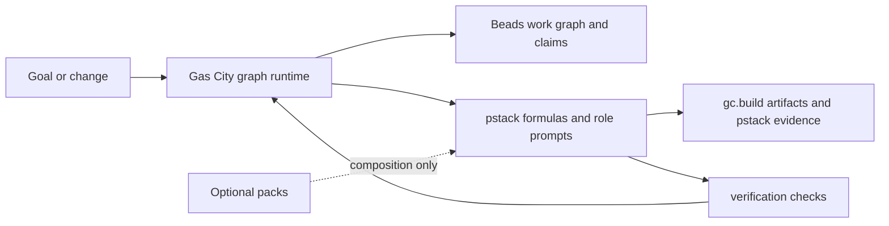
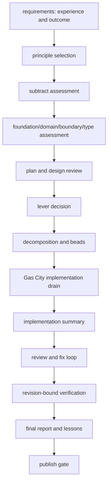

# PStack Gas City Pack Design

## Boundary



Gas City owns graph execution, durable state, claims, drains, continuation, retries, and workspaces. PStack owns method selection, principle enforcement, evidence schemas, and providerless prompts. Optional packs compose formulas; they never become required runtime dependencies.

## Build flow



`pstack-build` is a derived `build-base` formula. Its extra gates attach to base anchors; they do not fork or replace the lifecycle. Separate and same-session drains use the base contracts and selector variables.

## Data schemas

`pstack.route.v1` records a poteto-mode classification. Status is `routed` or
`unsupported`. The table is `pstack/mappings/playbooks.toml`.

### Shared lifecycle artifacts

Use the imported schemas without wrappers:

- `gc.build.requirements.v1`: goal, scope, acceptance, constraints, user experience.
- `gc.build.plan.v1`: ordered implementation steps, dependencies, verification predicates.
- `gc.build.decomposition.v1`: beads, ownership, boundaries, dependencies, completion predicates.
- `gc.build.implementation-summary.v1`: changed files, claims, checks, evidence.
- `gc.build.review.v1`: findings, severity, disposition, verification status.
- `gc.build.final-report.v1`: outcome, evidence, remaining risk, publication state.

### PStack-specific schemas

PStack adds only method evidence not represented by `gc.build.*`:

| Schema | Required data |
|---|---|
| `pstack.source-binding.v1` | id, source path/section/commit, target formula/node, realization type, status, rationale |
| `pstack.principle-application.v1` | principle, trigger, decision, enforcement, evidence |
| `pstack.foundation.v1` | domain, boundaries, invariants, ownership, rejected assumptions |
| `pstack.lever-decision.v1` | repeated cost, lever, pilot, fanout threshold, decision |
| `pstack.reproduction.v1` | symptom, input, environment, expected/actual, repeatability |
| `pstack.root-cause.v1` | causal chain, evidence, rejected hypotheses, fix boundary |
| `pstack.verification.v1` | subject kind/id, revision, checks, evidence references, verdict |
| `pstack.arena-candidate.v1` | candidate, shape, assumptions, evidence, tradeoffs |
| `pstack.arena-synthesis.v1` | candidates, cross-judge, synthesis, decision, dissent |
| `pstack.swarm-result.v1` | child work, claims, findings, aggregation, unresolved items |
| `pstack.decision.v1` | problem, options, chosen path, subtraction, rationale |
| `pstack.frontier.v1` | active frontier, dependencies, owner, predicate, escalation |
| `pstack.standing-orders.v1` | order, trigger, scope, expiry, evidence target |
| `pstack.program-status.v1` | goal, phase, predicate, blockers, restart token, evidence |
| `pstack.route.v1` | playbook, formula, class, reason, evidence |

Every PStack artifact carries stable work/claim references and evidence status. Every PStack schema declares the shared coverage-status vocabulary and `producer.attempt` so the shared validator can validate nonempty trace coverage. Static or metadata evidence is never labeled runtime evidence.

## Formula graph

- `pstack-poteto-mode`: classify then write `pstack.route.v1`. No auto-sling.
- `pstack-how`, `pstack-why`, and `pstack-investigation`: read-mostly sequence → evidence artifact.
- `pstack-swarm`: sequential frame, fanout, and fanin steps writing `pstack.swarm-result.v1`. `gc.graph_operator` is inert annotation. This checkout has no consumer.
- `pstack-arena`: sequential trigger, candidates, judge, and verify steps. This checkout writes one `pstack.arena-candidate.v1` path. Target fanout is a Gas City provider panel, not a pack-local Task spawn and not a `graph_operator` interpreter. See **Provider panel fanout**.
- `pstack-interrogate`: sequential select, review, and judgment steps. This checkout does not expand reviewer children. Target fanout is the same provider panel, with N review artifacts then one judgment and no apply step.
- `pstack-autonomous-run`: goal → predicate → baseline → bounded loop → evidence → predicate check.
- `pstack-orchestrate`: extends `pstack-build`. Standing-order and frontier steps run after the inherited implementation drain. It does not schedule outside Gas City.

## Provider panel fanout

Cursor arena and interrogate get N-model signal by spawning host children with model slugs. This pack must not copy that. Roles stay providerless. Gas City owns dispatch.

Four layers stay distinct.

1. **Session provider.** `city.toml` `[session].provider` (Herdr tabs). City-wide. Not a model list.
2. **Role patch.** `[[rigs.patches]]` maps one agent directory to one coding-agent provider. Duplicate patches for one agent are a city defect. Unpatched roles inherit `[workspace].provider`.
3. **Provider catalog.** `[providers.<id>]` is a frozen harness plus `args`. Gas City Formula daemons pick the model in those args (`--model`). One id does not accept a second model on Formula-managed daemon work. One-shot `--model` is not a `gc sling` target.
4. **Provider panel (target).** A city table `[[provider_panels]]` will list catalog ids from `[providers.<id>]`, not model slugs. After Gas City consumes the key, cook will create N child beads, isolate workspaces, and bind each child to one member. Diversity is N provider ids, each with its own frozen `--model`. The pack will stamp a panel id and a per-child path template. It will not name `cursor-grok`, `antigravity`, `composer-2.5`, or any other provider or model string.

This checkout does not stamp `gc.provider_panel`. Stamping a key with no compiler consumer repeats the `gc.graph_operator` honesty gap. Pack formulas stay sequential until Gas City consumes the panel key (expected `formula_compiler` floor above `2.0.0`). Durable Gherkin lives in this repository under `openspec/`.

**What a city operator does when the consumer exists.**

```toml
[workspace]
provider = "claude"

[session]
provider = "herdr"

[providers.cursor-grok]
base = "builtin:cursor"
args = ["--model", "cursor-grok-4.5-high", "--force"]

[providers.cursor-composer]
base = "builtin:cursor"
args = ["--model", "composer-2.5", "--force"]

[providers.antigravity]
base = "builtin:antigravity"
args = ["--model", "Gemini 3.5 Flash (High)"]

[[provider_panels]]
id = "pstack-arena"
members = ["cursor-grok", "cursor-composer", "antigravity"]

[[provider_panels]]
id = "pstack-interrogate"
members = ["cursor-grok", "antigravity", "cursor-composer"]
```

This TOML is operator `city.toml`, not pack formula text. A typical Formula map uses this trio (planner, worker, other-review). Native and frontier are extra Cursor clones. Add those ids to the panel when you want those frozen `--model` pins. Do not paste these strings into pack TOML.

`herdr` must not appear in `members`. Model slugs such as `composer-2.5` must not appear in `members`. Listing `cursor-grok` twice does not yield two models. A second Grok pin needs a second catalog id. Missing panel or a one-member panel is sequential fallback on the same sling name. Two members that share the same frozen `--model` are two beads and one model. That is a city misconfig, not pack diversity.

Panel children keep the step's `gc.run_target`. Cook binds each child to one member id and overrides that role's 1:1 patch for those beads only. `{child_id}` is an opaque slot assigned at cook. It is not the provider id, so artifact paths do not leak catalog names. Interrogate `select` still picks review dimensions. The panel fans the `review` node, not a second axis of personas.

**What the pack will stamp (not in this checkout's formulas).**

- `gc.run_target = "pstack.arena-runner"` or `pstack.reviewer`
- `gc.provider_panel = "pstack-arena"` or `pstack-interrogate`
- `gc.child_artifact_path_template` with `{child_id}` so N writers never share `.gc/pstack/arena-candidate.md`

Judge and judgment stay sequential after those artifacts. Interrogate does not copy `pstack-build-review` apply-findings.

**What already fans out today.** Sibling methodology packs (`bmad`, `superpowers`, `gstack`, `compound-engineering`) and `build-basic-review` use `type = "expansion"` with named persona lanes. Distinct `gc.run_target`s are review personas on the city's patched provider. They are not N-model. `pstack-build-review` is the same primitive with two lanes that share `pstack.reviewer`, so they share one provider. Do not reuse that as arena.

**Interim if a city needs N providers before the panel consumer.** Distinct `gc.run_target` names plus distinct `[[rigs.patches]]` rows. That freezes N in pack TOML. This repository OpenSpec prefers the panel so N lives in the city.

Build variants compose these formulas:

- feature: `pstack-build` plus experience, subtraction, and verification gates;
- bug-fix: reproduction and root-cause before the build plan, then same-surface verification;
- refactor/migration: subtraction, foundation, callers, lever/pilot, migration waves, legacy absence;
- perf: baseline, bounded experiment, and revision-bound verification;
- prototype: experience target, smallest verifiable slice, explicit expiry;
- shipping: catalog alias of `pstack-build`;
- babysit/autopilot: extend `pstack-build`, so they inherit implement and publish until a later formula-design change detaches them.

## Role and code flow

1. A Gas City formula creates graph nodes with abstract `gc.run_target` values.
2. Gas City dispatches a role with a scoped prompt and claim token.
3. The role reads only the selected principle skills and required artifacts.
4. The role writes a result artifact and claims evidence against the node.
5. Gas City updates Beads state and unlocks dependent nodes.
6. Checks validate schema, revision, ordering, and absence predicates.

The pack has no provider-specific API calls. Runtime assets can select interaction and review modes, but the runtime remains Gas City-owned.
