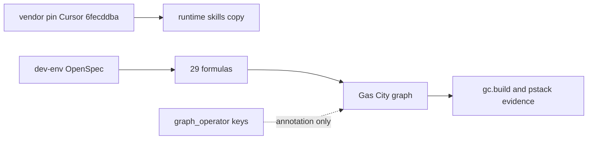
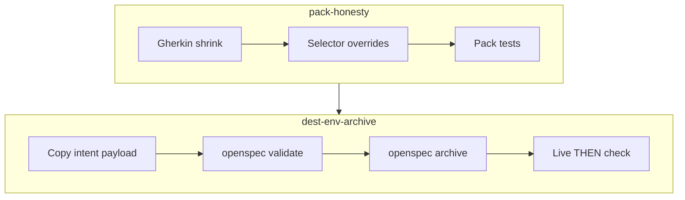

## Context

The PStack pack is a schema-2 Gas City methodology layer. Durable specs live in
dev-env. The pack vendors official Cursor pstack from `cursor/plugins` path `pstack`
at `6fecddba65801f9b9c08b8b328d998ee5b09d290` and byte-copies `skills/` into
the runtime tree. Gas City mapping lives in pack-owned formulas and assets.
Refresh work already landed in the pack and was mostly copied into live specs
by hand (`fb366ba3`) without `openspec archive`.

Assumptions: Mermaid is the diagram format. Rigor is a lightweight container
view of pack versus runtime versus specs.

## Goals / Non-Goals

**Goals:**

- Make live Gherkin describe the formulas that exist today.
- Keep the vendor pin explicit and later source drift reviewable.
- Encode the compiler-requirement check that the pack suite already runs.
- Name the optional-pack catalog that the pack file actually lists.

**Non-Goals:**

- No Gas City interpreter for `gc.graph_operator` / `pstack.graph_operator`.
- No vendor pin advance to maintained HEAD.
- No archive of `refresh-pstack-pack-source-and-formula-requirements` in this
  change. That archive needs a later grant after its deltas are rewritten.
- No babysit/orchestrate redesign off `pstack-build`.
- No metadata-cook script.

## Decisions

1. **Tell the truth in method scenarios.** Sequential frame/fanout/fanin,
   trigger/candidates/judge/verify, and select/review/judgment steps stay.
   `graph_operator` remains annotation. TRACEABILITY keeps the known gap.

2. **Do not name a moving maintained SHA in TRACEABILITY.** Name the reviewed
   pin and the drifted path classes. A SHA such as `72d6da2` goes stale the
   next time maintained pstack lands a docs commit.

3. **Keep optional action packs as city-scope composition, not this catalog.**
   `optional-packs.toml` lists methodology packs. GitHub/Slack/PR Pipeline stay
   as external-action owners when a city imports them.

4. **No new durable ADR.** ADR-0029 already covers pin, validator portability,
   and the graph-operator non-interpreter. This change corrects spec language.

## Risks / Trade-offs

- Honest Gherkin is a behavior change in the spec, not in Gas City. Callers who
  read swarm as native fanout will see the contract shrink. That is the point.
- Leaving the refresh change unarchived keeps two overlapping active folders
  until a later archive grant. Safer than colliding ADDED requirements.

## Migration Plan

1. Land this change's proposal, specs, design, and ADR review in dev-env.
2. Update pack TRACEABILITY, DESIGN, and focused tests in gascity-packs.
3. Run `openspec validate audit-pstack-gascity-pack-contracts --type change --strict`
   and `pytest pstack/tests/test_pstack_pack.py`.
4. Archive only after an explicit grant. Do not archive the earlier refresh
   change from this work.

## Open Questions

- When to rewrite and archive `refresh-pstack-pack-source-and-formula-requirements`.
- When Gas City publishes a graph-operator interpreter, a later change must
  restore executed-fanout Gherkin rather than keep this annotation contract.
