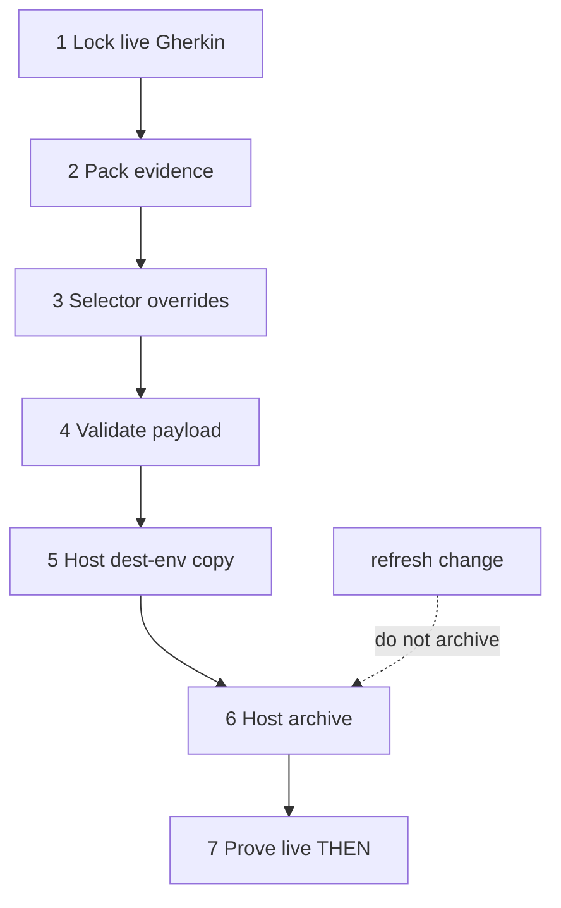

# Task graph

## 1. Lock remaining live gaps

- [x] 1.1 Restate method-formula Gherkin so swarm, arena, and interrogate are sequential annotated steps.
- [x] 1.2 Restate optional-pack composition to the catalog in `optional-packs.toml`.
- [x] 1.3 Add the post-pin reviewable-drift scenario without a moving maintained SHA.
- [x] 1.4 Add the delivery check that every formula declares `formula_compiler >= 2.0.0`.
- [x] 1.5 Shrink vendor-parity, principle-catalog, graph-ordering, migration, and continuation-test Gherkin.
- [x] 1.6 Record sibling selector overrides on planning and decomposition.

## 2. Apply pack evidence

- [x] 2.1 Update `pstack/TRACEABILITY.md` pin-drift language and metadata evidence class.
- [x] 2.2 Align `pstack/DESIGN.md` method-graph bullets with unconsumed `graph_operator` metadata.
- [x] 2.3 Add focused tests for TRACEABILITY drift, graph-operator keys, selectors, and ungated migration steps.

## 3. Verify payload

- [x] 3.1 Run `pytest pstack/tests/test_pstack_pack.py`.
- [x] 3.2 Run `python pstack/scripts/apply_intent_change.py --validate-only`.
- [x] 3.3 Leave `refresh-pstack-pack-source-and-formula-requirements` unarchived.

## 4. Host dest-env apply

Needs 3.

- [ ] 4.1 From a host shell, run `python pstack/scripts/apply_intent_change.py --dest /home/tommyk/projects/dev-env`.
- [ ] 4.2 Run `openspec validate audit-pstack-gascity-pack-contracts --type change --strict` in dest-env.
- [ ] 4.3 With explicit archive grant, run `python pstack/scripts/apply_intent_change.py --dest /home/tommyk/projects/dev-env --archive`.
- [ ] 4.4 Prove live swarm THEN is sequential `frame`, `fanout`, and `fanin`.
- [ ] 4.5 Prove `refresh-pstack-pack-source-and-formula-requirements` is still active.

## 5. Dual source of truth

- [x] 5.1 Record Cursor pstack tree `6fecddba` as discipline source in TRACEABILITY and ARCHITECTURE.
- [x] 5.2 Record gascity-packs workflow packs and `build-base` primitives as packing reference.
- [x] 5.3 Keep runtime vendor on the reviewed tommy-ca pin so host-boundary greps stay fail-closed.
- [x] 5.4 Omit `watch-pr/` and `orch/` from vendored and runtime `skills/poteto-mode/scripts/`. Do not retarget the pin to Cursor.
- [x] 5.5 Vendor only skills, README, and LICENSE. Drop plugin agents, guide docs, and Benny automations.
